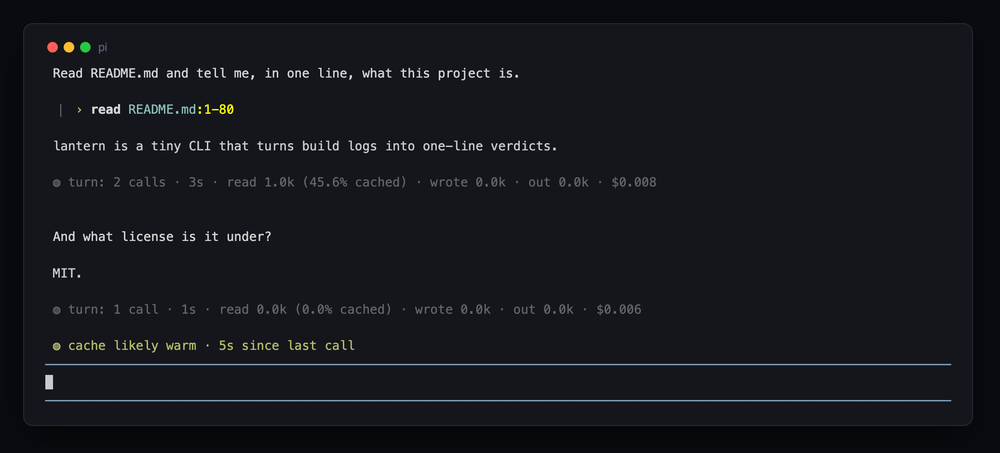
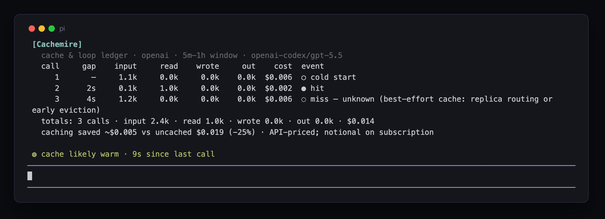

# pine-of-glass

Small observability and context management tools for [Pi](https://github.com/earendil-works/pi) in the terminal.
1. [`contextimate`](./extensions/pi-contextimate) breaks down what is filling your context window: sysprompt, AGENTS.md, Skill frontmatter, Tool schemas, and session material. Toggle with ctrl+o on start and /reload.
2. [`traceline`](./extensions/pi-traceline) collapses tool calls to one trace line each, so you can see the full arc of what Pi did (path taken, context read, bloated tool results). Toggle with ctrl+t (expands/collapses both thinking blocks and tools so you can see everything your agent did since your last message).
3. [`cachemire`](./extensions/pi-cachemire) (**experimental**) explains cache behaviour and agent-loop economics: a cache TTL clock above the editor, predicted-then-resolved cache-break notices, a per-turn ledger, and `/cache` forensics. Included in the package as of `0.4.0`; wording, thresholds, and states may still evolve.

See each extension's own `README.md` for details, and `docs/` for deeper reference.

## Installation
- From GitHub: `pi install git:github.com/tmustier/pine-of-glass`
- From npm (installs `contextimate`, `traceline`, and experimental `cachemire`): `pi install npm:pine-of-glass`

## Screenshots
### [Traceline](./extensions/pi-traceline)
The full arc of a working session — reads folded per file, edits carrying their diff facts, one failed build tinted, everything else calm:


### [Contextimate](./extensions/pi-contextimate)
What is in your context window before you type a word:


### [Cachemire](./extensions/pi-cachemire)
Per-turn ledger lines and the cache clock above the editor, then `/cache` forensics on demand:





## Development

```bash
npm run link-pi         # symlink the installed pi runtime into node_modules (types + contract tests)
npm run link-extensions # symlink the extensions (as directories) into ~/.pi/agent/extensions
npm run typecheck       # tsc against the real installed pi
npm test                # unit + golden + pi contract tests (zero deps, node:test)
npm run test:smoke      # launches real pi in tmux with an isolated HOME (local-only)
```

Extensions share code through [`extensions/_lib`](./extensions/_lib) (number grammar,
family style — glyphs, theme-derived ink, panel headers — ANSI helpers, chat-container
detection, config convention). The visual grammar all three speak is specified in
[`docs/design-language.md`](./docs/design-language.md); when a renderer and that document
disagree, one of them is wrong. pi resolves extension-relative
imports against the symlink path, so local installs must link the extension *directories*
plus `_lib` — `npm run link-extensions` does exactly that. `_lib` has no `index.ts`, so
pi's extension discovery skips it.

The contract suite pins every structural assumption about pi internals, so after `pi update` a quick `npm test` says exactly which seam (if any) drifted. Test design notes live in [`docs/testing.md`](./docs/testing.md). Goldens regenerate with `UPDATE_GOLDENS=1 npm test` — review the diff like code.

## Plans
1. The current goal is to provide an interface that makes tool and agent behaviour more legible for humans using pi in their terminal interactively. 
2. Once that's solid, we can help both humans and agents to more easily analyse previous sessions and traces, including when pi is running in RPC mode, remotely, or there is a large number of agent sessions we need to read to get insights from.

*Note: A nice side benefit of 1. is that tools like `traceline` can help agents running interactive pi subagents in tmux to monitor them without risking context bloat from tool outputs.*

**Status:** There are several things left to do in 1., including
- maturing [`cachemire`](./extensions/pi-cachemire) (implemented, live-tested, conformant with the family design language, and now shipped as experimental while the UX settles — see issue #6),
- making `contextimate` more useful beyond upfront context (for example, are my MCP servers and skills efficient when loaded?)
- and other refinements tracked in issues.
