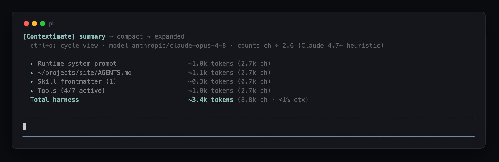
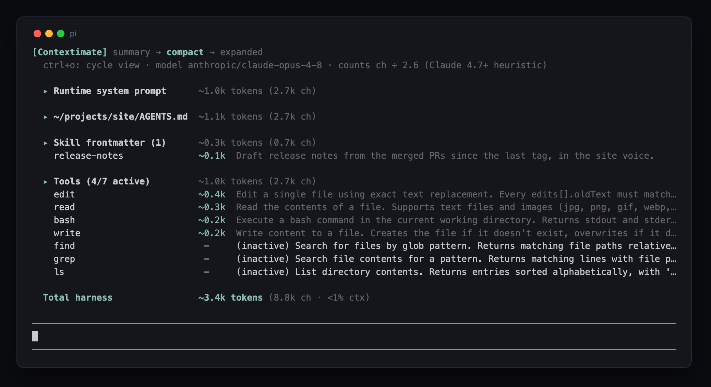
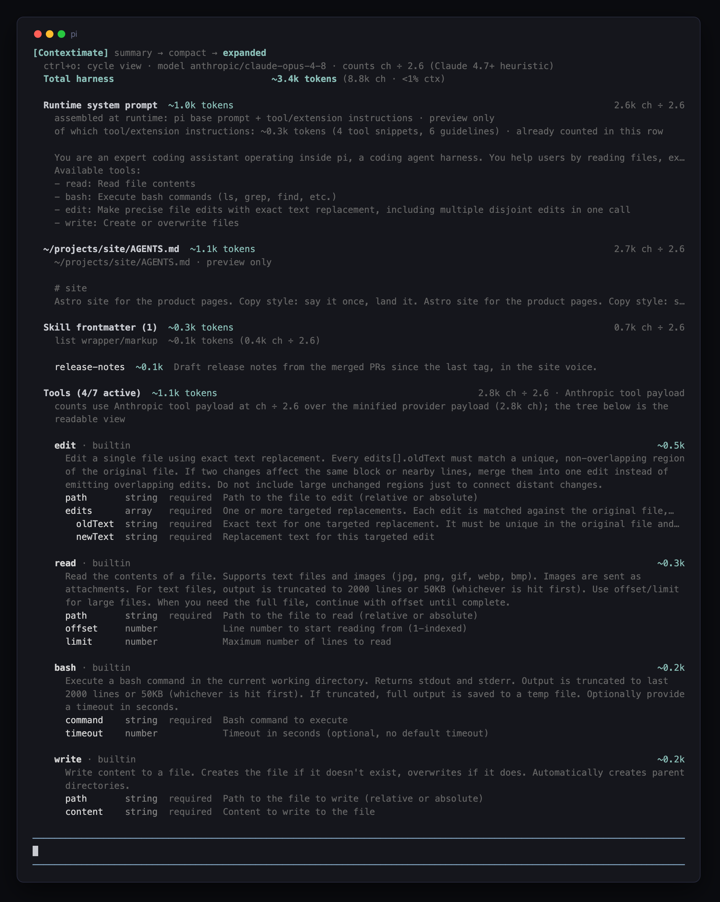

# pi-contextimate

`pi-contextimate` adds a startup `[Contextimate]` panel to Pi that shows what is filling the model's context window before you type anything: the runtime system prompt, AGENTS.md files, the always-loaded skill index, active tool schemas, and session material.



`Ctrl+O` cycles 2 deeper views. Compact is a scan view: one aligned line per skill and per tool, sorted by estimated tokens.



Expanded adds each section's counting method and sources, plus a readable schema tree for every active tool.



## Install

Install from npm:

```bash
pi install npm:pine-of-glass
```

Try it for one run without installing:

```bash
pi -e npm:pine-of-glass
```

For local development from a clone:

```bash
pi -e ./extensions/pi-contextimate
```

## Use

The panel renders after Pi's native startup resource list and re-inserts itself if a chat rebuild (for example `Ctrl+T` or `/reload`) drops it.

- `Ctrl+O`, Pi's expand and collapse key, cycles summary, compact and expanded
- `/contextimate` also cycles; `/contextimate summary`, `/contextimate compact` and `/contextimate expanded` jump to a mode

How to read the numbers:

- every `~` number is an estimate; `Total request` drops it only when Pi's current total is fully provider-reported, and keeps it when trailing messages add a local estimate
- the dim hint line under the header states the counting method once, for example `counts ch ÷ 2.6 (Claude 4.7+ heuristic)`; data rows carry only their raw size, like `(9.2k ch)`
- the method follows the active model, so switching models re-estimates immediately; named Claude 4.7+ models keep their tokenizer profile through supported Radius and OpenRouter relays
- until the first post-switch response, `Total request` names its old currency (`pre-switch usage · <model> tokens`) and withholds only that total's context bar and window share
- the first row says `Runtime system prompt` because Pi assembles that prompt at runtime from its base prompt plus tool and extension contributions; expanded view attributes the part it can verify
- `Skill frontmatter` counts the always-loaded skill index only, not skill bodies, which load on demand
- each expanded tool header shows where the tool came from: its config scope and defining file, or `builtin`
- `Reasoning context` sums provider-reported exact counts for signed reasoning retained by the response anchoring Pi's total; it follows Claude and OpenAI's model-specific retention defaults
- Pi's exact prompt total, including cache reads and writes, rejects historical attribution that cannot fit; summaries not covered by exact counts remain estimated separately as `Thinking summaries`
- opaque signatures are never treated as token-sized text, and cross-model reasoning is not counted as retained
- `Unattributed` is the remaining accounting gap and can include prefix-estimation error, provider overhead, images and reasoning when the provider reports no breakdown

The panel's visual grammar is the family design language: see `docs/design-language.md`.

## How it counts

Sections are counted on provider-shaped payloads with per-model heuristics, never on local object size. [`docs/pi-contextimate.md`](../../docs/pi-contextimate.md) explains the counting policy, the evidence behind each heuristic, and the JSON config for overriding them per provider or model.

Three packaged diagnostics measure rather than guess:

- `pi-contextimate-probe-prefix` captures what Pi actually sends and prints sanitized sizes and usage
- `pi-contextimate-evaluate-transcripts` checks the session heuristics against recorded usage in local session files
- `pi-contextimate-check-provider-tokens` gets provider-exact token counts for a captured payload and suggests calibrated denominators

See [`scripts/contextimate/README.md`](../../scripts/contextimate/README.md) for usage.
