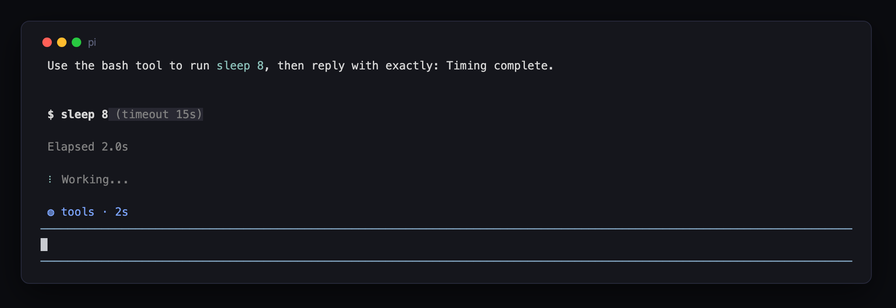
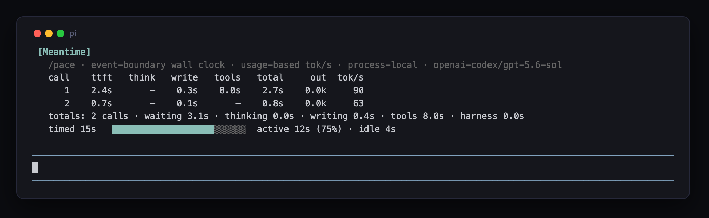

# pi-meantime

> **Status: experimental and opt-in.** New in `pine-of-glass` `0.7.0`; wording,
> thresholds, and states may change without notice. Meantime is feature-flagged off by
> default. Track [#26](https://github.com/tmustier/pine-of-glass/issues/26).

Explains where the wall-clock went. pi's footer *counts* elapsed time; meantime
*decomposes* it: is the model thinking or stuck, why was that call slow, and where did
the session actually go?

**A tempo line above the input box** names the current phase of the wait and how long
it has held, so a long silence reads as information instead of anxiety. Live rates are
estimated from streamed chars and wear `~`; the line turns warning ink once the wait
passes the session's own slow-start bar, and hides when the loop is idle:

```
◍ waiting · 3s                                       (no first token yet)
◍ thinking · 42s · ~50 tok/s
◍ writing · 8s · ~48 tok/s
◍ tools · 31s · 3 running                            (wall-clock, not a sum)
◍ waiting · 14s · slow start (median 1.9s)           (warning ink)
```



**Anomaly notices** are chat lines appended when a call resolves clearly slower than
this session's rolling per-model median: slow first tokens (with prefill named as the
cause when usage proves it, `cause unknown` when it does not) and collapsed stream
rates. Healthy calls print nothing:

```
◍ slow start · first token 14s (median 1.9s) · cause: prefill 145.3k uncached prompt tokens
◍ slow stream · 11 tok/s (median 50 tok/s) · 2.1k tokens over 3m10s
```

**`/pace`** renders the tempo ledger: one aligned row per model call (ttft, think,
write, tools, total, output tokens, exact tok/s), notes where a row earned one, a
totals row, and one session line with an active-against-idle share bar. A ledger
that spans model switches states the model count and marks each transition. Idle is
a first-class bucket, not noise; it is often the session's punchline:

```
[Meantime]
  /pace · event-boundary wall clock · usage-based tok/s · process-local
  call    ttft   think   write   tools   total     out  tok/s
     1    1.9s     42s    8.0s     31s   1m22s    2.1k     48
     2    1.7s    3.0s     12s    4.2s     17s    0.8k     41
     3     14s    6.1s    5.0s     22s     26s    0.7k     35  slow start (median 1.9s)
  totals: 3 calls · waiting 18s · thinking 51s · writing 25s · tools 57s · harness 4.6s
  timed 1h42m   ██▒▒▒▒▒▒▒▒▒▒▒▒▒▒▒▒▒▒▒▒▒▒▒  active 10m (10%) · idle 1h32m
```



## Install

Install from npm:

```bash
pi install npm:pine-of-glass
```

Try it for one run without installing:

```bash
pi -e npm:pine-of-glass
```

For local development from a clone:

```bash
pi -e ./extensions/pi-meantime
```

## Use

Meantime is inert by default. To opt in, create `~/.pi/agent/pi-meantime.json` for
all projects or `<project>/.pi/pi-meantime.json` for one project, then run `/reload`:

```json
{
  "enabled": true,
  "widget": true,
  "notices": true,
  "slowStartFactor": 3,
  "slowStartFloorMs": 5000,
  "slowStreamFactor": 3,
  "slowStreamMinTokens": 300,
  "baselineMinCalls": 3,
  "prefillCauseTokens": 20000
}
```

`enabled` is the feature flag. Unless it is explicitly `true`, Meantime registers no
hooks, timer, widget, notices, or `/pace` command. Once enabled, there is nothing to
press: the tempo line ticks during a run, notices arrive on their own, and `/pace`
prints the ledger.

A slow start fires when a call's first token takes at least `slowStartFactor` times
the rolling median *and* clears the absolute floor; a slow stream fires when a call
with at least `slowStreamMinTokens` output tokens resolves at or under the median rate
divided by `slowStreamFactor`. Baselines are per model and need `baselineMinCalls`
resolved samples, so short sessions and ordinary variance stay silent.

Honesty rules:

- Every duration is a wall-clock observation at an event boundary in this process:
  request sent, first typed content event, stream segment edges, tool execution edges.
  Nothing comes from provider-reported timing (none exists) and nothing is
  reconstructed from restored session history, which cannot yield first-token latency
  or segment splits; a resumed session's earlier calls are simply not timed.
- Time to first token is one number on purpose: it bundles network, queue, and
  prefill, and that split is not observable, so no split is claimed. Prefill is still
  nameable as a *cause* from usage evidence (uncached prompt tokens).
- Resolved tok/s is exact: provider output tokens over the observed stream span. Live
  tok/s is an estimate from streamed chars and always wears `~`; its chars-per-token
  ratio self-calibrates from resolved calls. Silent-reasoning calls show no resolved
  rate and do not calibrate live rates, because their hidden generation has no
  observable start boundary and their streamed chars undercount output.
- A silent pre-text gap is `waiting`, never `thinking`. When usage later reports
  reasoning tokens for a call whose stream carried no thinking blocks, the row is
  noted `wait incl. silent reasoning` rather than inventing a thinking span.
- Parallel tools report the interval union, never a sum; overlap is noted, not
  double-counted. The live tool clock uses the same union, so harness gaps before or
  between executions never appear as tool time. The harness gap (call end to next
  request, minus tool wall-clock) is only claimed when a next request actually
  bounded it.
- Everything meantime draws is UI-only: nothing enters LLM context, session entries,
  or exports.

## How it sits in the family

| | granularity | currency | question |
|---|---|---|---|
| contextimate | static prefix | estimated tokens | what am I carrying? |
| traceline | per tool call | exact chars | what did tools do? |
| cachemire | per model call / turn | exact provider tokens & $ | what did the loop cost, and why? |
| **meantime** | per stream segment | exact wall-clock ms | what happened in the meantime? |

The ledger opens with the family panel header (`[Meantime]` in the theme accent);
tones are theme-derived through the shared `ink()` helper, and tempo facts share
cachemire's loop-economics glyph `◍`: the same voice, a different currency (see
[`docs/design-language.md`](../../docs/design-language.md), §10).

Notice lines are appended to pi's chat container directly and persist across pi's
chat rebuilds through the same durable-anchor machinery cachemire uses; if the
internal seam ever drifts, meantime degrades to plain `notify` lines and the contract
test suite names the break. Nothing in pi's `node_modules` is modified, so it
survives `pi update`.
