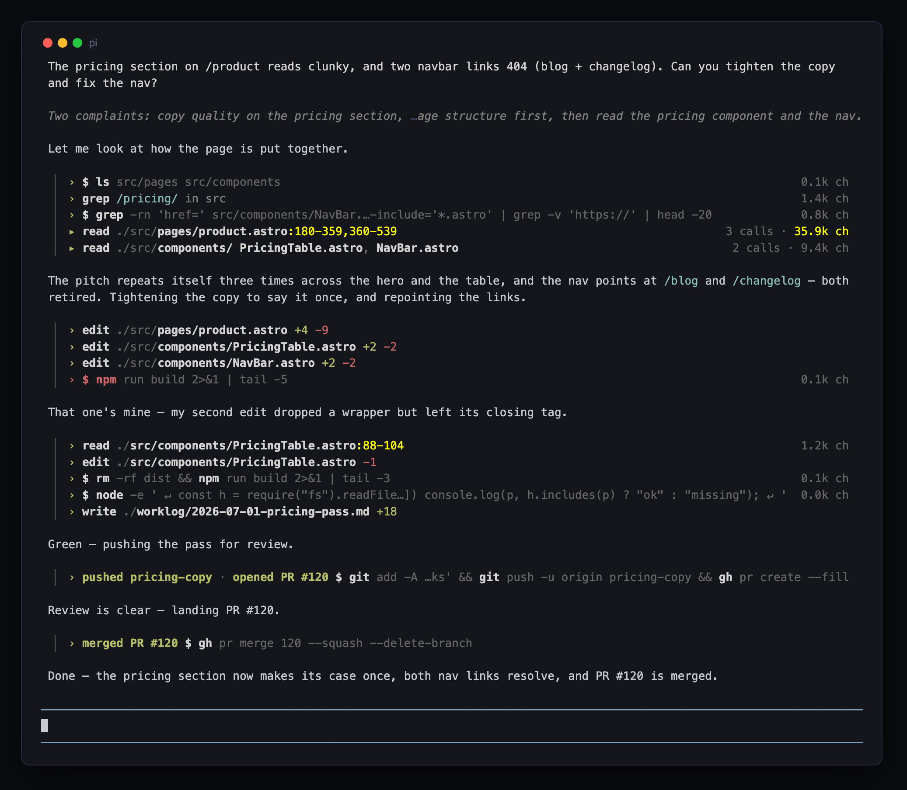

# pi-traceline

`pi-traceline` collapses each tool call in a turn to a single, scannable **trace line**, so the turn reads as a timeline: which path Pi took, what context it pulled in, which outputs ballooned. It is built for the "I let Pi run for a couple of minutes and came back" moment; `Ctrl+T` flips back to full native detail whenever you want it.



Each row leads with its verb and target, file mutations carry a `+N -M` diff cell, commands that changed shared state carry a record of what they did, and completed rows end in a result-size cell on a shared right edge:

```
  ▏ › read resource .pi/agent/AGENTS.md:1-20                 1.4k ch
  ▏ › [skill] google-workspace-stack:1-20                    1.0k ch
  ▏ › subagent delegate                                      0.1k ch
  ▏ › edit ~/projects/demo/index.ts                   +3 -1 · 0.1k ch
  ▏ › write /tmp/pi-extension-test-...-elephant.txt   +5 -0 · 0.0k ch
  ▏ › $ rm /tmp/pi-extension-test-...-elephant.txt ...       0.0k ch
```

## Install

Install from npm:

```bash
pi install npm:pine-of-glass
```

Try it for one run without installing:

```bash
pi -e npm:pine-of-glass
```

For local development from a clone:

```bash
pi -e ./extensions/pi-traceline
```

## Use

`pi-traceline` rides Pi's native reasoning-visibility toggle and adds no keybinding of its own:

- `Ctrl+T` toggles Pi's reasoning visibility; tool rows follow the same state
- reasoning shown → native tool rows, untouched (full detail)
- reasoning hidden → each tool row collapses to one trace line

The collapse state is read from a live assistant row, so the tool view can never desync from the reasoning view. Pi's own `Thinking blocks: hidden/visible` status caption is suppressed (with every tool row visibly collapsing, the toggle is self-evident). Plain terminal scrolling is never touched: traceline requests no mouse reporting.

Size thresholds are overridable via the family config convention (`~/.pi/agent/pi-traceline.json` or `<cwd>/.pi/pi-traceline.json`):

```json
{ "sizeWarningChars": 10000, "sizeErrorChars": 50000 }
```

## How to read a row

- **Status lives in the bullet** (`›`): green success, blue running, red error. Healthy rows keep every discriminator neutral bold; a *failed* call also tints its verb, bash head command, and basename error-red, so a failure is more than one red glyph in a dim wall.
- **A dim `▏` rail** opens every row, and the block indents one gutter under the prose margin, so consecutive calls fuse into one visible block: block identity from indentation and one character of layout, not painted backgrounds.
- **The result-size cell** (`1.4k ch`, in the family number grammar) is severity-tinted: dim while healthy, warning-coloured at ≥10k ch, error-coloured at ≥50k ch, so an over-large output jumps out of the column. Results under 100 ch show no cell, but the floor is block-scoped: if any row in a contiguous block clears it, every completed row in the block shows its cell, keeping the right edge aligned.
- **Diff cells** on `edit` and `write` rows show `+N -M` with zero sides dropped (`+5`, not `+5 -0`). Within a block they form two right-aligned columns, units under units, so materiality reads as width. `write` stats come from a pre-execution snapshot; restored rows not seen live may show only the size.
- **Record facts** appear on bash rows that changed shared state beyond the working tree (`git commit`/`push`, `gh pr merge`/`close`/`create`, `gh issue close`, `gh release create`, `npm publish`): verb-first cells like `committed a4f21c9 · pushed main`, parsed from the success output the tool actually *reported*, never from the command's arguments. Each fact wears the ink of what it states (success-toned bold; a sha stays dim as audit data; a forced push tints warning), per fact rather than per row: a failed push after a good commit shows a green `committed` on a red row. On narrow rows whole facts drop oldest-first; the size cell keeps the rightmost column.

Rendering reuses Pi's own tool-call renderer for most tools, so accented paths, warning line ranges, and custom-tool renderers track Pi's defaults; traceline's own ink is theme-derived and its unstyled spans demote to one dim supporting grey. The full visual grammar is the family design language: see [`docs/design-language.md`](../../docs/design-language.md) §9.

## Bash rows

A bash row anchors on a bold `$`, then bolds the head word of every command that informs, and dims everything else (arguments, connectors, redirects, heredoc markers) to the one supporting grey:

```
  ▏ › $ cd ~/projects/pine-of-glass && npm test 2>/dev/null | tail -5  1.4k ch
```

The bold is rationed to commands that carry signal (measured over a 51k-invocation corpus; see [`scripts/dev/bash-corpus/`](../../scripts/dev/bash-corpus/)):

- `cd … &&` and `set -…` preambles, and `echo`/`true`/`false`/`printf`/`exit` plumbing (`|| true`, `&& echo done`), stay dim whenever a real command is present; a row that is *nothing but* preamble or plumbing keeps its first head, so `$ cd /tmp` never goes dark
- `&&`, `||`, `;` and flattened line breaks start new commands whose heads bold; pipes and redirects continue one (`| head -240` is a filter and stays dim)
- sequencers inside quoted scripts are data (`python3 -c '…'` bolds `python3` once and nothing inside the string), and heredoc bodies stay inert

Multiline commands (heredocs, inline scripts, chained pipelines) flatten into the one trace line with a dim `↵` marking each original break, and the near-constant `(timeout Ns)` suffix is dropped; the full invocation is one `Ctrl+T` away.

## Repetition folds instead of re-printing

The informative diff between adjacent rows is often small while a shared prefix dominates, so three folds keep the trace skimmable:

```
  ▏ › $ cd ~/projects/pine-of-glass && npm test 2>/dev/null | tail -5  1.4k ch
  ▏ › $ ⋯ && npm run typecheck                                        14.2k ch
  ▏ › read ~/projects/pine-of…dex.ts:1-200,201-400,401-600  3 calls · 51.1k ch
```

- **Repeated `cd <dir> && ` preambles** render as a dim `⋯` when they repeat the previous bash row's (pi's bash tool is stateless per call, so agents re-`cd` on every call). The first occurrence keeps the full path, and a `⋯` never points across visible prose.
- **Paginated reads** of one file fold into a single row with the combined ranges, call count, and total size. Anything visible between the reads breaks the fold; `Ctrl+T`'s native view restores the individual rows.
- **Collapsed thinking previews** render as `Thinking: <first reasoning line> ... (N lines)`, with adjacent label runs coalesced, and each tool row sits tight under the preview that motivated it, so each thought→action couplet reads as one unit.

## Reading the end of the line

The discriminating part of a row usually lives at the tail (the basename plus `:range`, the operative end of a pipeline) while the head is boilerplate. So instead of a trailing ellipsis that deletes the signal, traceline:

- **tildifies** home directories to reclaim width before truncating (OSC 8 hyperlink URLs stay intact, so click targets keep working)
- **middle-truncates** with a dimmed `…` at deterministic, block-scoped columns: every row in a block shares one body budget, so ellipses and tail edges line up down the block and the tail always survives
- **collapses cwd to a dim `./`** on plain file reads, edits, and writes (`~/projects/site/src/pages/product.astro` renders as `./src/pages/product.astro` when the row ran in `~/projects/site`); paths outside cwd keep their tildified absolute form, so the asymmetry itself says in-repo vs out-of-repo
- **dims the boring prefix**: the block's common directory prefix or the cwd prefix dims, and the divergent tails render bold

```
  ▏ › read ~/projects/pine-of-glass/…/pi-traceline/README.md:1-300        3.8k ch
  ▏ › read ~/projects/pine-of-glass/…/pi-traceline/index.ts:1-200        18.5k ch
  ▏ › $ cd ~/projects/pine-of-glass && rm -f docs/img/…-native.png        0.0k ch
```

## How it works

- On `session_start` it captures the real TUI and wraps `requestRender`, then patches the shared tool-row component prototype's `render` the moment a tool row exists (and the assistant-row prototype, for collapsed-thinking previews). The patches are versioned and idempotent across reloads and session resumes.
- While reasoning is shown, `render` defers to Pi's original implementation unchanged. While reasoning is hidden, it emits the single trace line.
- Any failure inside the one-line path falls back to Pi's original `render`, so the extension can never break a frame.
- Nothing in Pi's `node_modules` is modified, so it survives `pi update`.
